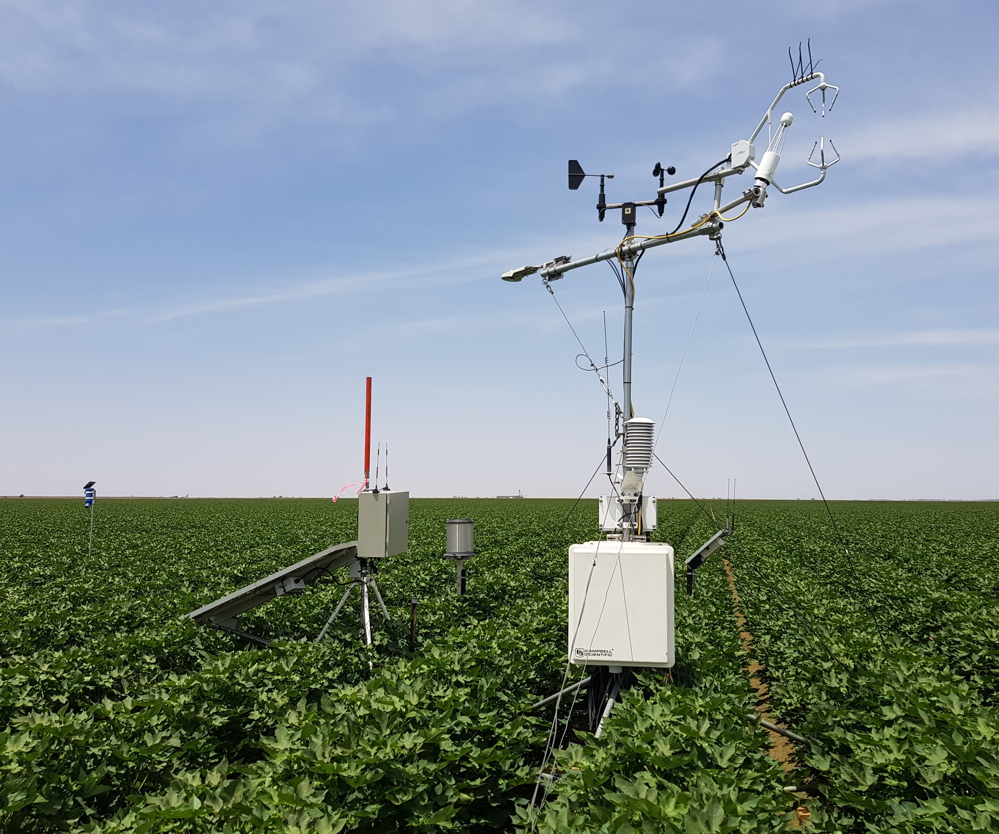
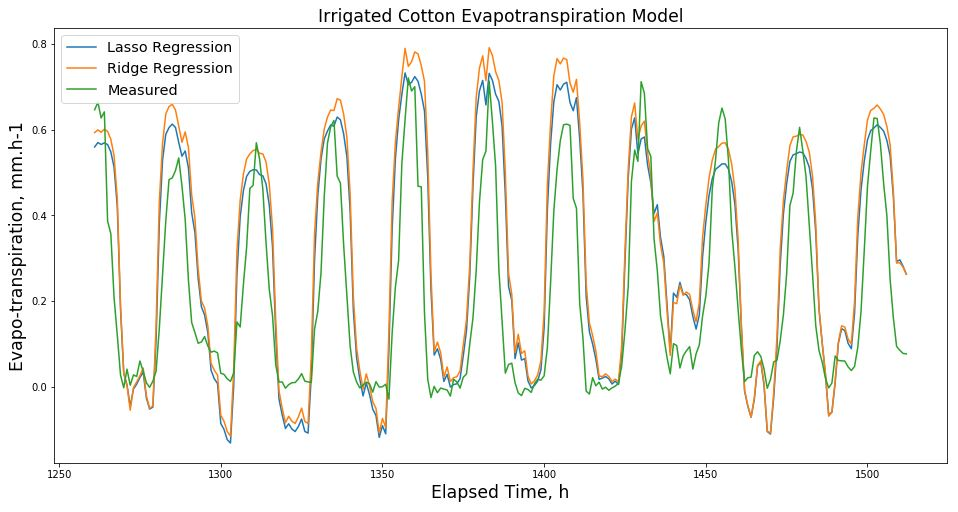

```{r setup, include=FALSE}
knitr::opts_chunk$set(
  results = 'asis',
  echo = FALSE,
  warning = FALSE,
  message = FALSE,
  fig.align = 'center'
)

#Load libraries
library(tidyverse)
library(gapminder)
library(gganimate)
library(kableExtra)
library(knitr)
library(jpeg)
library(png)

# read ML dataframe
df_ml_1hr_scaled_12 <- read_csv("//Nexus/Home/n/nad018/synthesis/machine_learning/outputs/ml_data_1hr_scaled-12.csv")

```


# Introduction
Research Technician, Soil Process & Function - prior experience coding CRBASIC dataloggers, ladder logic PLC's and C+ microcontrollers. Previous work pattern involved data visualisation and analysis in Excel, further processing in open-source software, then presenting results in Excel graphs and Word tables.

# My Synthesis Project
The project objective was to develop a machine learning model of evapotranspiration (ET) in irrigated cotton using high frequency measurements from a variety of soil, crop and meteorlogical sensor platforms.

A set of 10 features were selected. Meteorlogical features included 10 Hz measurements of air temperature, humidity, vapour pressure deficit, 3D wind speed, rainfall and solar radiation.  Crop features were the temperatures of canopy leaves, dry reference and ambient air at minute intervals.  Soil features consisted of hourly water content and temperature. Target ET flux rates were calculated as the covariance of gas concentrations and vertical wind speed components.

Replicated features were first averaged then feature data were reduced to 1 hour means. Missing timestamps were infilled, outliers removed and data gaps interpolated to complete the time series. Features were scaled then hyperparameters tuned by nested cross validation prior to Lasso and Ridge regression analysis. The inital iterations were trained chronologically on 80% of data and tested on the following 20% of data. 

# My Digital Toolbox
Both R and Python were used in this project. R libraries used consisted of tidyverse, padr, imputeTS, lubridate, and scales. Python modules included numpy, pandas, scatter_matrix, pyplot, scale, cross_val_score, TimeSeriesSplit, Ridge, RidgeCV, Lasso, Lasso CV, mean_squared_error, r2_score. All of these digital tools were learned since starting Data School.

## Favourite tool
My favorite Python tool was Mayplotlib for visualising data as it has capabilities not available from ggplot in R. In R I found the 'padr' library to be a very efficient tool for analysing dataframes for time series gaps, inserting rows and infilling missing timestamps.  

# My time went ...
Processing the raw data with differing file structures and from a variety of source directories took 80% of the project time. After raw data processing most of the remaining time was used aquiring the knowledge to develop the machine learning workflow and to make appropriate subjective decisions for machine learning validation, training and testing. One very surprising finding was the regression coefficients indicated the feature expected to be most important was ranked 3rd by the Ridge algorithm and dropped entirely by Lasso.

# Next steps
Ongoing work would include improving predicted ET accuracy by sliding window validation to better incorporate the influence of the increasing crop canopy cover over time, as well as examining the effect of reduced feature sets. Also of value would be applying CO2 gas emmission rate measurements as the model target. Related time series models may also be developed for forecasting of ET and CO2 emission rates.

<br/>
**Field Measurement Site**
{width=1200px}
<br/>

<br/>
<br/>
**Target and Features Dataframe**
{width=1400px}

```{r mytable, out.width = '50%', echo = F}
#knitr::kable(head(df_ml_1hr_scaled_12, n = 5), format = "html") %>% 
#  kable_styling("striped")
```
<br/>
<br/>
**Machine Learning Results**
{width=1400px}

# My Data School Experience
I greatly enjoyed the ongoing support provided the network of Data School trainers, mentors and previous participants and was very impressed by the wide range of skills taught. I have been applying my new skills to recent project reporting, processing data and generating visualisations not possible before Data School. I will be presenting my Data School experiences and sythesis project results to our local laboratory group. As well, my machine learning project will be an additional outcome for the research project that provided the dataset and further model developments are anticipated.